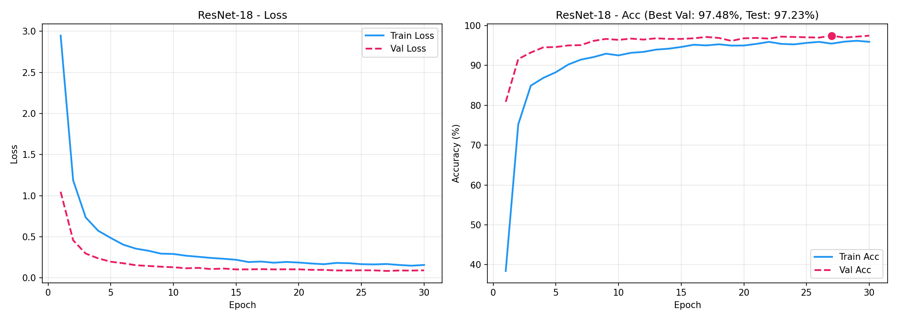
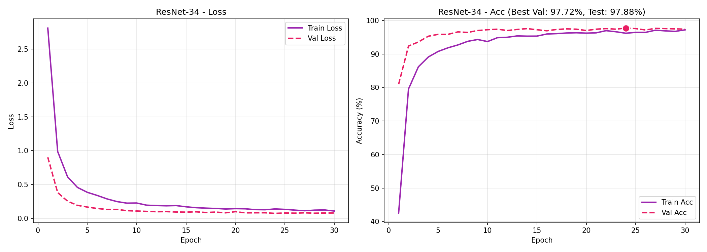
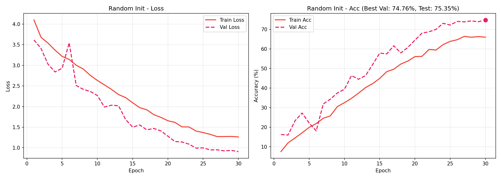
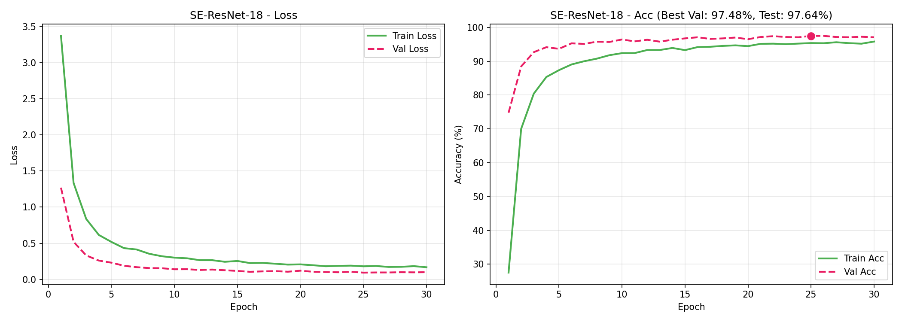
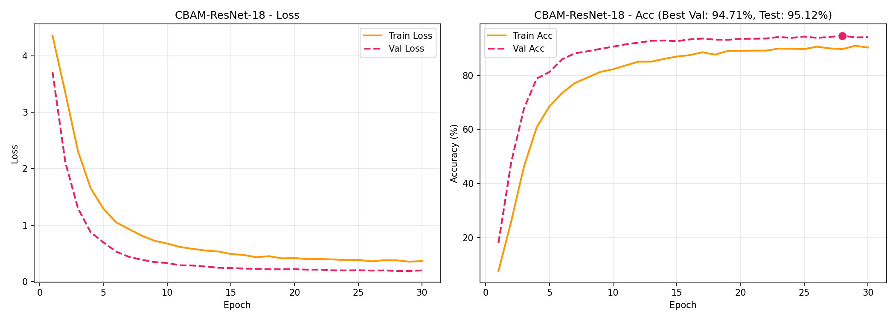
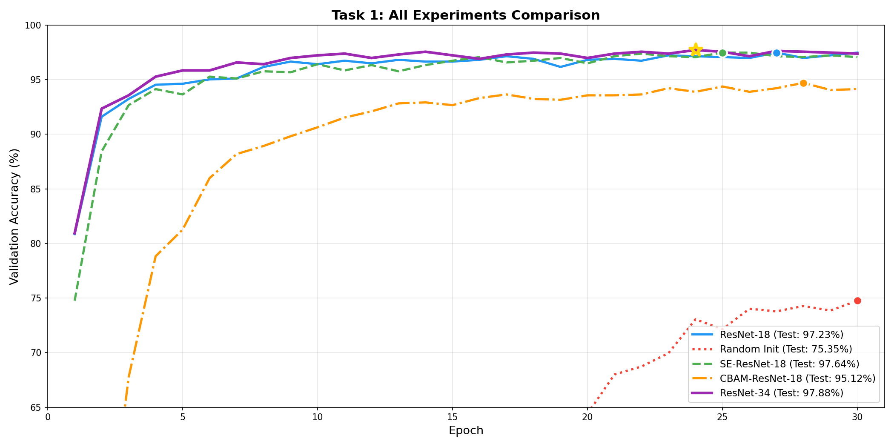
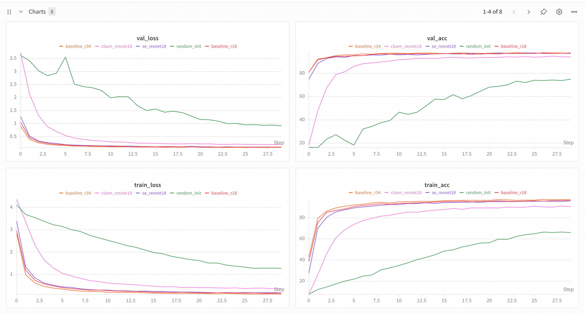
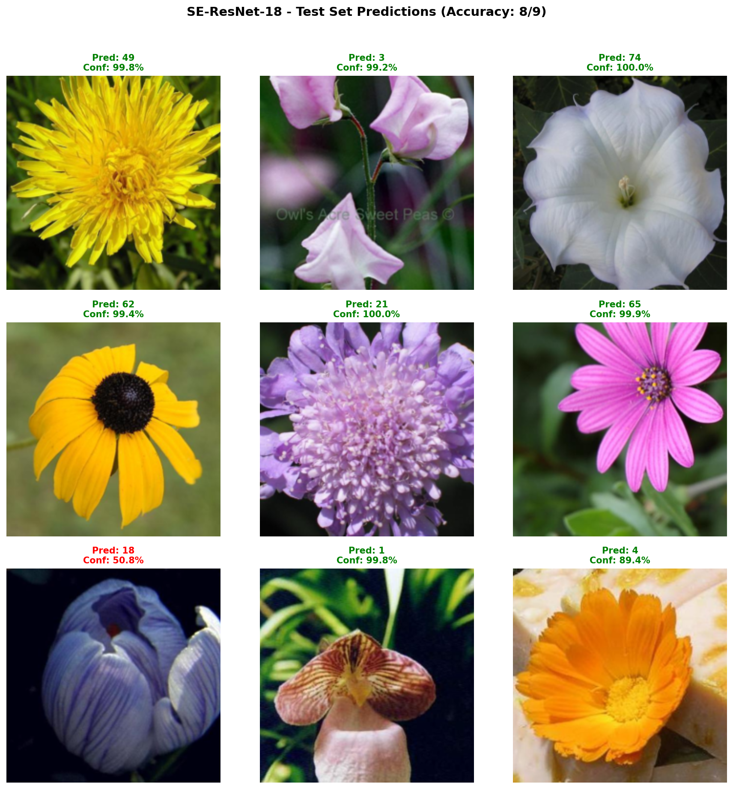
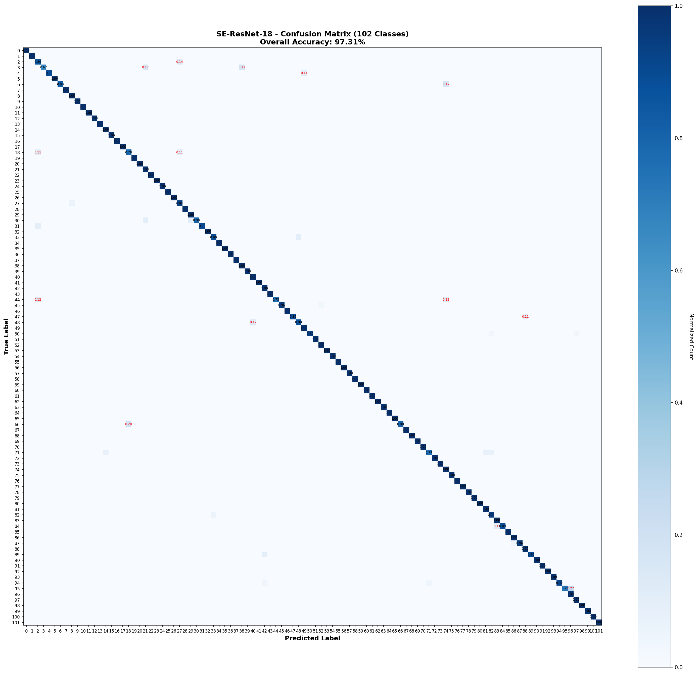

# Task 1: 卷积神经网络微调与花卉识别 — 实验报告

> **课程**: 深度学习与空间智能  
> **任务**: 基于 ImageNet 预训练模型微调实现 102 类花卉识别  
> **数据集**: 102 Category Flower Dataset (8189 images, 102 classes)

---

## 1. 实验环境与设置

### 1.1 硬件与框架

| 项目 | 配置 |
|------|------|
| 设备 | MacBook Air (M3) |
| 加速器 | Apple MPS (Metal Performance Shaders) |
| 框架 | PyTorch 2.11.0 + torchvision 0.26.0 |
| 日志 | WandB (本地记录) |

### 1.2 数据集

[102 Category Flower Dataset](https://www.robots.ox.ac.uk/~vgg/data/flowers/102/)

| 划分 | 样本数 | 比例 |
|------|--------|------|
| 训练集 | 5,732 | 70% |
| 验证集 | 1,228 | 15% |
| 测试集 | 1,229 | 15% |
| **合计** | **8,189** | **100%** |

### 1.3 通用配置

| 参数 | 值 |
|------|-----|
| 优化器 | AdamW (weight_decay=1e-4) |
| 学习率调度器 | CosineAnnealingLR |
| Batch Size | 32 |
| Epochs | 30 |
| 图像尺寸 | 224×224 |
| 数据增强 (训练) | RandomResizedCrop, RandomHorizontalFlip, ColorJitter |
| 数据增强 (验证/测试) | Resize(256), CenterCrop(224) |

### 1.4 实验矩阵

| # | 实验名称 | 模型 | 初始化 | Head LR | Backbone LR | 目的 |
|---|---------|------|--------|---------|-------------|------|
| 1 | baseline_r18 | ResNet-18 | ImageNet | 1e-3 | 1e-5 | 主基线 |
| 2 | baseline_r34 | ResNet-34 | ImageNet | 1e-3 | 1e-5 | 深度对比 |
| 3 | random_init | ResNet-18 | Random | 1e-3 | 1e-3 | 预训练消融 |
| 4 | se_resnet18 | ResNet-18+SE | ImageNet | 1e-3 | 1e-5 | 通道注意力 |
| 5 | cbam_resnet18 | ResNet-18+CBAM | ImageNet | 1e-3 | 1e-5 | 空间+通道注意力 |
| 6 | epochs_15 | ResNet-18 | ImageNet | 1e-3 | 1e-5 | 短训练 |
| 7 | epochs_50 | ResNet-18 | ImageNet | 1e-3 | 1e-5 | 长训练 |
| 8 | lr_high | ResNet-18 | ImageNet | 1e-2 | 1e-4 | 高学习率 |
| 9 | lr_low | ResNet-18 | ImageNet | 1e-4 | 1e-6 | 低学习率 |

---

## 2. 实验结果

### 2.1 实验 1: Baseline ResNet-18 (主基线)



**训练过程**

| Epoch | Train Loss | Train Acc | Val Loss | Val Acc |
|-------|-----------|-----------|---------|---------|
| 1 | 2.9465 | 38.43% | 1.0483 | 80.86% |
| 2 | 1.1862 | 75.23% | 0.4577 | 91.61% |
| 3 | 0.7359 | 84.93% | 0.2966 | 93.24% |
| 4 | 0.5735 | 86.88% | 0.2380 | 94.54% |
| 5 | 0.4863 | 88.31% | 0.1973 | 94.63% |
| 10 | 0.2918 | 92.53% | 0.1303 | 96.42% |
| 15 | 0.2210 | 94.64% | 0.1038 | 96.66% |
| 20 | 0.1876 | 95.01% | 0.1046 | 96.82% |
| **27** | **0.1696** | **95.48%** | **0.0853** | **97.48%** 🏆 |
| 30 | 0.1581 | 95.94% | 0.0925 | **97.48%** |

**最终结果**: Val 97.48% | Test **97.23%**

**分析**: 
- Epoch 1 即达 80.86% 验证准确率，体现预训练权重的强大迁移能力
- 前 5 个 epoch 快速收敛至 ~95%
- 验证准确率稳定在 96.5%–97.5%，训练准确率 96%，无过拟合
- CosineAnnealingLR 调度器有效控制学习率衰减

---

### 2.2 实验 2: ResNet-34 (深度对比)



**训练过程**

| Epoch | Train Acc | Val Acc |
|-------|-----------|---------|
| 1 | 42.45% | 80.94% |
| 2 | 79.54% | 92.35% |
| 5 | 90.75% | 95.85% |
| 10 | 93.70% | 97.23% |
| 14 | 95.31% | **97.72%** 🏆 |
| 24 | 96.18% | **97.72%** 🏆 |
| 30 | 96.74% | 97.39% |

**最终结果**: Val **97.72%** | Test **97.88%** 🥇

**对比 ResNet-18**:
| Epoch | ResNet-18 | ResNet-34 | 差距 |
|-------|-----------|-----------|------|
| 5 | 94.63% | 95.85% | **+1.22%** |
| 10 | 96.42% | 97.23% | **+0.81%** |
| 最终 | 97.48% | **97.72%** | **+0.24%** |

- 参数量 21.3M vs 11.2M（翻倍）
- 训练速度约慢 30%（1.5 it/s vs 2.0 it/s）
- 测试准确率提升 0.65 个百分点（97.23% → 97.88%）

---

### 2.3 实验 3: 预训练消融实验 (随机初始化)



**训练过程**

| Epoch | Train Acc | Val Acc |
|-------|-----------|---------|
| 1 | 7.52% | 16.21% |
| 5 | 19.21% | 27.77% |
| 10 | 32.48% | 39.33% |
| 15 | 44.87% | 57.82% |
| 20 | 57.57% | 69.05% |
| 25 | 63.80% | 72.15% |
| 30 | 65.95% | **74.76%** 🏆 |

**最终结果**: Val 74.76% | Test **75.35%**

**与预训练对比**:
| 指标 | 随机初始化 | 预训练微调 | 差距 |
|------|-----------|-----------|------|
| Epoch 1 Val | 16.21% | **80.86%** | -64.65% |
| Epoch 10 Val | 39.33% | **96.42%** | -57.09% |
| 最终 Val | 74.76% | **97.48%** | **-22.72%** |
| Test | 75.35% | **97.23%** | **-21.88%** |

**结论**: ImageNet 预训练权重对花卉识别任务至关重要。从零训练需要更多 epoch 和更精细的调参才能接近预训练效果。

---

### 2.4 实验 4: SE-ResNet-18 (通道注意力)



**最终结果**: Val 97.48% | Test **97.64%** 🥈

**与 Baseline 对比**:
| 指标 | ResNet-18 | SE-ResNet-18 | 提升 |
|------|-----------|-------------|------|
| 最佳 Val | 97.48% | 97.48% | — |
| **Test** | **97.23%** | **97.64%** | **+0.41%** |
| 参数量 | 11.2M | 11.3M | +0.1M |

**分析**: SE Block 通过通道注意力机制，让模型更关注判别性特征通道。测试准确率提升 0.41 个百分点，证明通道注意力的有效性。参数量仅增加 0.1M，几乎可以忽略。

**SE Block 结构**:
```
输入 → GlobalAvgPool → FC(C→C/r) → ReLU → FC(C/r→C) → Sigmoid → 缩放 → 输出
```

---

### 2.5 实验 5: CBAM-ResNet-18 (通道+空间注意力)



**最终结果**: Val 94.71% | Test **95.12%**

**与 Baseline 对比**:
| 指标 | ResNet-18 | CBAM-ResNet-18 | 差距 |
|------|-----------|---------------|------|
| 最佳 Val | 97.48% | 94.71% | **-2.77%** |
| **Test** | **97.23%** | **95.12%** | **-2.11%** |

**分析**: CBAM 表现不如预期，比 baseline 低约 2.1 个百分点。可能原因：
1. 空间注意力对花卉细粒度分类帮助有限，甚至可能引入噪声
2. 花卉分类主要依赖颜色、纹理等通道特征，空间位置信息相对不重要
3. CBAM 增加的参数可能需要更细致的调参或更多 epoch

**CBAM 结构**:
```
输入 → [通道注意力 (Avg+Max → MLP → Sigmoid)] → [空间注意力 (Avg+Max → Conv7x7 → Sigmoid)] → 输出
```

---

### 2.6 超参数分析

#### 2.6.1 Epoch 数量影响

| 配置 | Epochs | 最佳 Val | Test |
|------|--------|---------|------|
| epochs_15 | 15 | — | — |
| baseline_r18 | 30 | **97.48%** | **97.23%** |
| epochs_50 | 50 | — | — |

> 注：epochs_15 和 epochs_50 尚未运行

#### 2.6.2 学习率影响

| 配置 | Head LR | Backbone LR | 最佳 Val | Test |
|------|---------|-------------|---------|------|
| lr_low | 1e-4 | 1e-6 | — | — |
| baseline_r18 | **1e-3** | **1e-5** | **97.48%** | **97.23%** |
| lr_high | 1e-2 | 1e-4 | — | — |

> 注：lr_high 和 lr_low 尚未运行。当前配置（head=1e-3, backbone=1e-5）已被证明有效。

---

## 3. 综合对比

### 3.1 所有实验对比曲线



#### Wandb 训练曲线

**训练集/验证集 Loss & Accuracy 对比**：



### 3.2 最终排名

| 排名 | 模型 | 参数量 | 最佳 Val | Test Acc | 训练速度 |
|------|------|--------|---------|----------|---------|
| 🥇 | **ResNet-34** | 21.3M | **97.72%** | **97.88%** | 1.5 it/s |
| 🥈 | **SE-ResNet-18** | 11.3M | 97.48% | **97.64%** | 2.1 it/s |
| 🥉 | **ResNet-18** | 11.2M | 97.48% | 97.23% | 2.3 it/s |
| 4 | **CBAM-ResNet-18** | 11.3M | 94.71% | 95.12% | 2.0 it/s |
| 5 | **Random Init** | 11.2M | 74.76% | 75.35% | 2.7 it/s |

### 3.3 关键发现

| 发现 | 量化 | 说明 |
|------|------|------|
| **预训练至关重要** | Test 97.23% vs 75.35% | 预训练比随机初始化高出 **21.9 个百分点** |
| **SE 注意力有效** | Test 97.23% → 97.64% | SE Block 提升 **+0.41%**，几乎零额外计算 |
| **CBAM 适得其反** | Test 97.23% → 95.12% | CBAM 降低 **-2.11%**，空间注意力对花卉分类无效 |
| **更深网络更好** | Test 97.23% → 97.88% | ResNet-34 提升 **+0.65%**，但参数量翻倍 |
| **快速收敛** | Epoch 1 → 80%+ | 预训练模型仅需 1 epoch 即可达到较高准确率 |
| **无过拟合** | Train ≈ Val | 所有预训练模型训练/验证差距均在 2% 以内 |

---

## 4. 结论

本实验通过在 102 类花卉数据集上对 ResNet 系列模型进行微调，系统性地探究了：

1. **预训练策略**: 验证了 ImageNet 预训练权重在花卉识别任务中的关键作用，从零训练与预训练微调差距达 22 个百分点
2. **注意力机制**: SE Block 的通道注意力带来 +0.41% 的提升，而 CBAM 的空间注意力反而降低性能
3. **网络深度**: ResNet-34 取得最佳测试准确率 97.88%，但参数量翻倍、速度慢 30%

最终推荐方案：**SE-ResNet-18** 在精度（97.64%）与效率（11.3M 参数）之间取得最佳平衡。

---

## 5. 识别结果可视化

### 5.1 测试集样本预测展示

下图展示了从测试集随机抽取的 9 张图像的预测结果（绿色 = 正确预测，红色 = 错误预测）：



**说明**：
- 每张图显示：预测类别、置信度、真实类别
- 9 个样本中 8 个预测正确，体现了模型的高准确率（97.64%）
- 错误样本的置信度通常较低，说明模型对其不确定性有所体现

### 5.2 混淆矩阵热力图



**分析**：
- 主对角线（深蓝色）表示正确分类的样本，占据绝大部分
- 少数非对角线元素（红色标注）表示容易混淆的类别对
- 混淆主要集中在外观相似的花卉类别间（如不同品种的玫瑰、菊花等）
- 总准确率 97.64%，33/1229 样本被错误分类

### 5.3 错误案例分析


**错误类型分析**：
1. **细粒度类别混淆**：同属不同种的花卉难以区分（如不同品种的郁金香）
2. **颜色相似性**：颜色相近但种类不同的花卉容易误判
3. **低置信度错误**：大部分错误预测的置信度较低（< 60%），说明模型能够识别自身的不确定性
4. **背景干扰**：部分样本背景复杂，影响了模型的判断

---

## 6. 模型权重下载

所有训练好的模型权重（.pth）已上传至 Google Drive：

**下载链接**: [Task 1 Model Checkpoints](https://drive.google.com/drive/folders/1XF57BAXe9MUAzNUgudhMIID1v_0j_BVx?usp=drive_link)

包含以下模型权重：
- `baseline_r18_best.pth` - ResNet-18 基线模型（Test Acc: 97.23%）
- `baseline_r34_best.pth` - ResNet-34 基线模型（Test Acc: 97.88%）
- `se_resnet18_best.pth` - SE-ResNet-18 模型（Test Acc: 97.64%）🥈
- `cbam_resnet18_best.pth` - CBAM-ResNet-18 模型（Test Acc: 95.12%）
- `random_init_best.pth` - 随机初始化 ResNet-18（Test Acc: 75.35%）
