# 实验报告：任务2 场景目标检测与视频多目标跟踪

## 1. 基本信息
- 任务目标：微调 YOLOv8 单阶段检测器，实现车辆检测、视频多目标跟踪、遮挡与 ID 跳变分析、越线计数。
- 数据集：Road Vehicle Images Dataset（Kaggle）。
- 模型：YOLOv8n（预训练权重 yolov8n.pt）。
- 跟踪：YOLOv8 + ByteTrack（bytetrack.yaml）。

## 2. 数据集与预处理
数据集自带 train/val 两个子集，目录组织采用 YOLO 格式：

```
<dataset_dir>/
  images/
    train/
    val/
  labels/
    train/
    val/
```

类别共 21 类：
- ambulance, army vehicle, auto rickshaw, bicycle, bus, car, garbagevan
- human hauler, minibus, minivan, motorbike, pickup, policecar, rickshaw
- scooter, suv, taxi, three wheelers -CNG-, truck, van, wheelbarrow

## 3. 模型与训练设置
- 模型：YOLOv8n（使用 yolov8n.pt 预训练权重初始化）。
- 训练参数（来自 config.yaml）：
  - Epochs: 100
  - Batch size: 64
  - Image size: 640
  - 初始学习率: 0.001
  - 权重衰减: 0.0005
- 损失函数：YOLOv8 默认损失（box/cls/dfl），训练日志对应 train/box_loss、train/cls_loss、train/dfl_loss。
- 优化器与调度：未显式修改，沿用 Ultralytics 默认配置。

## 4. 训练结果与可视化
训练与验证曲线（Loss 与 mAP）：

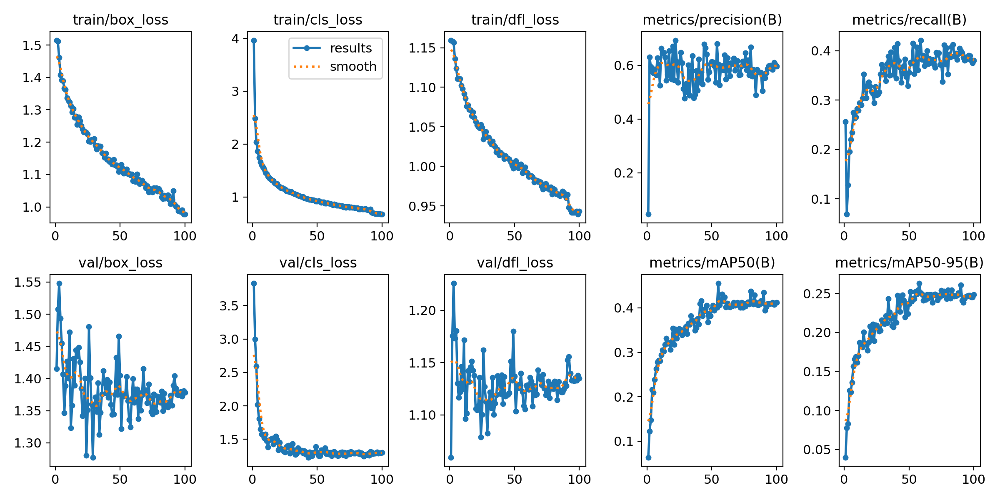

PR 曲线（检测性能概览）：

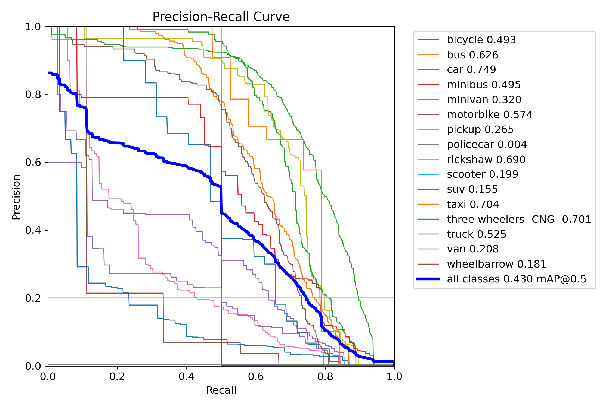

标签分布与框尺寸概览：

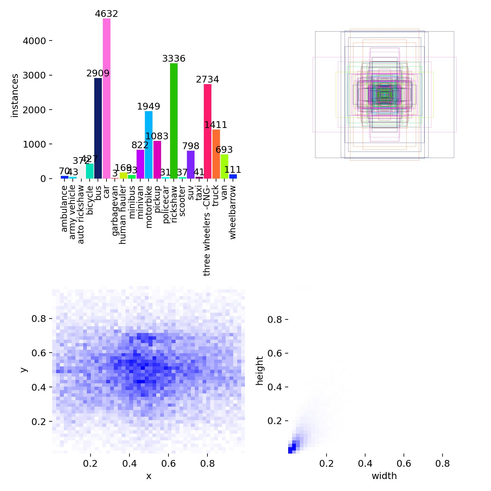

验证集可视化（labels vs pred）：

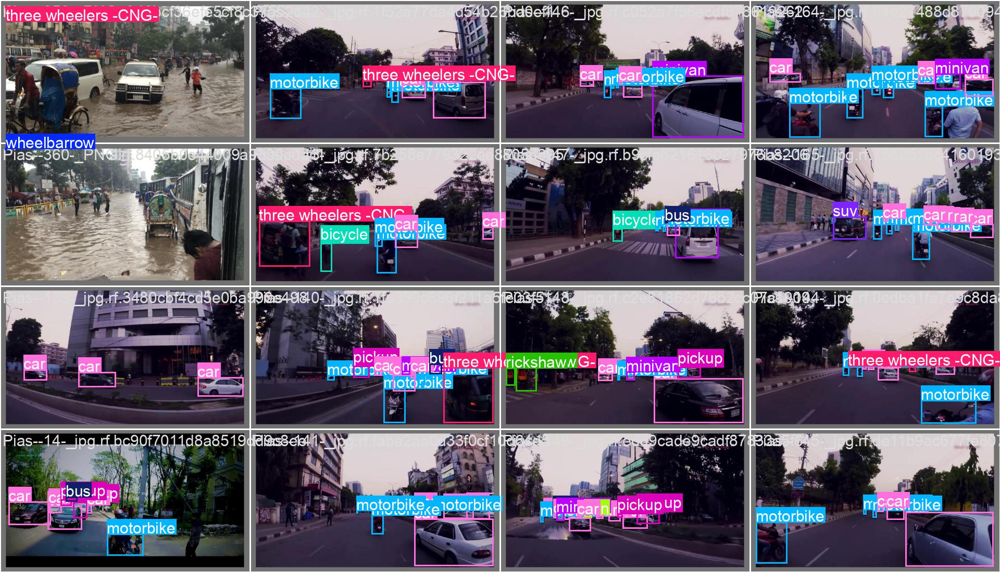
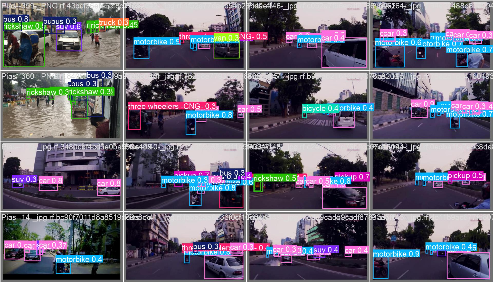
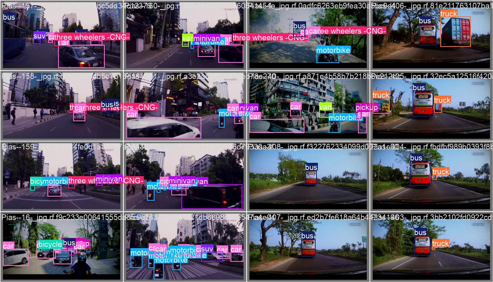
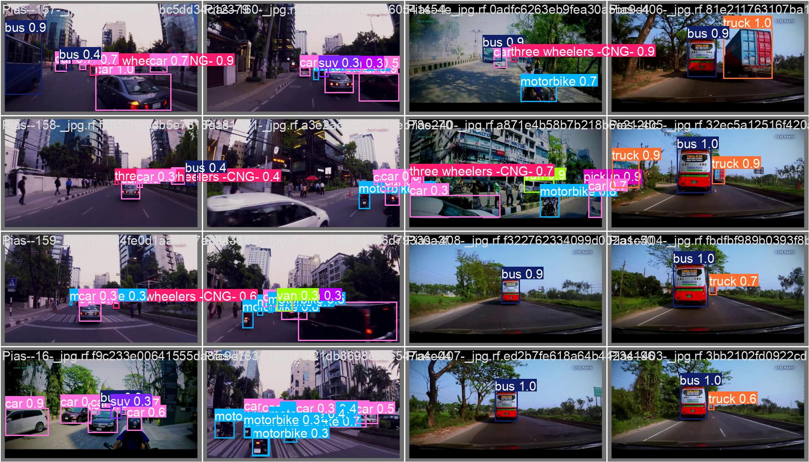

混淆矩阵（原始与归一化）：

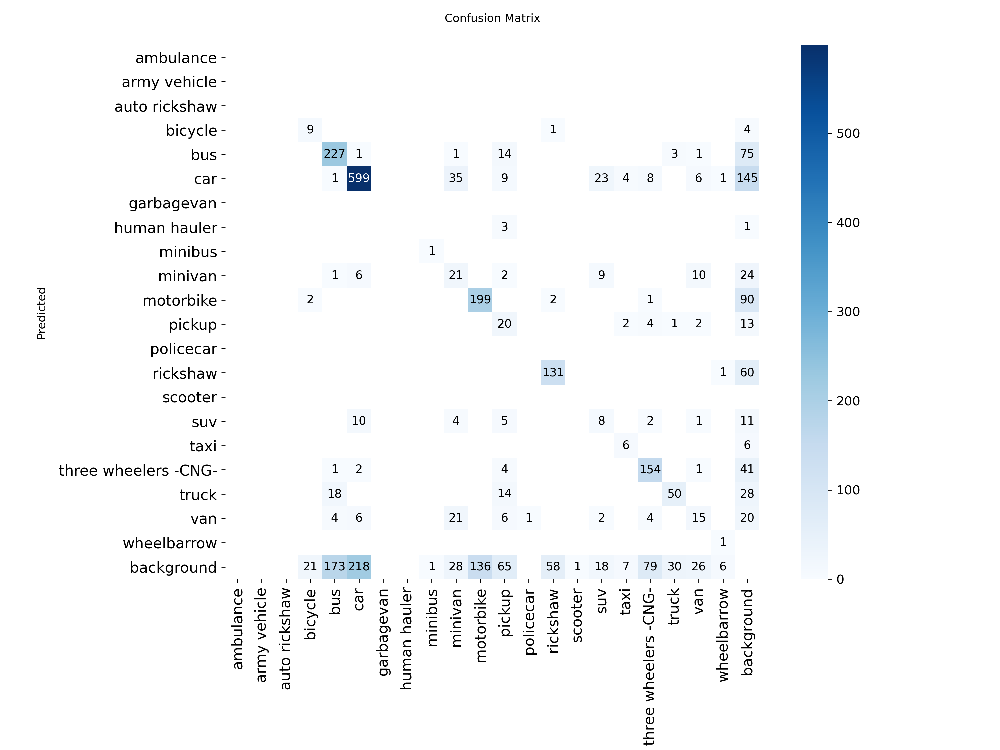
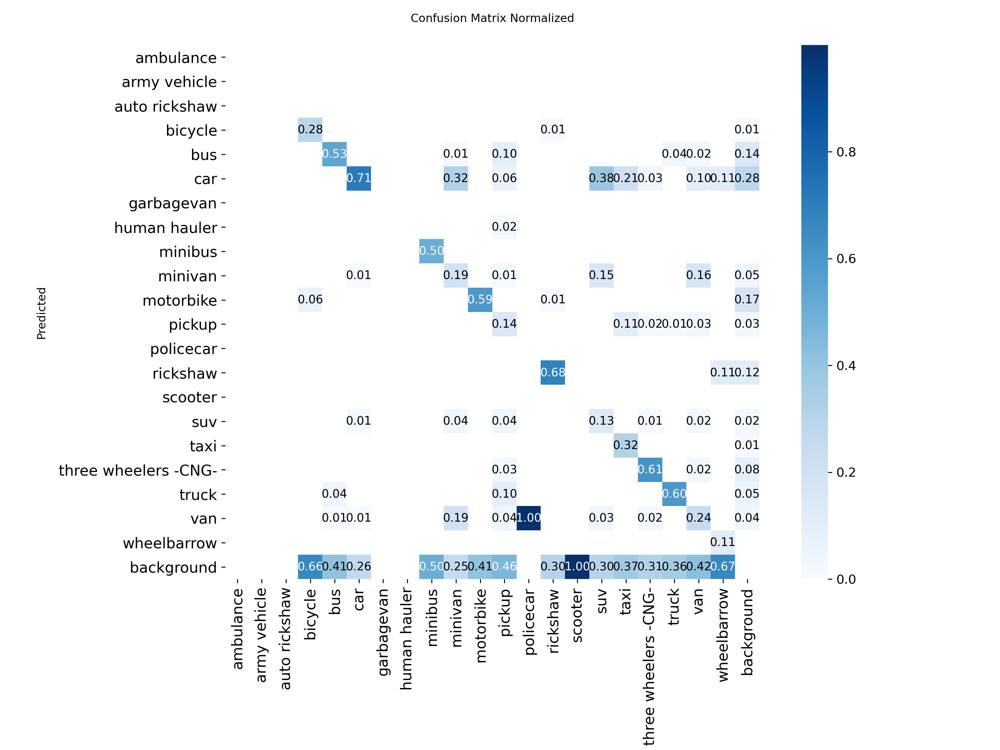

最终 Epoch（epoch=100）指标（results.csv）：
- Precision: 0.5971
- Recall: 0.3807
- mAP50: 0.4122
- mAP50-95: 0.2487

## 5. 视频检测与多目标跟踪
- 视频：car_flow.mp4（10-30 秒）。
- 跟踪参数（config.yaml）：
  - conf: 0.25
  - iou: 0.7
  - imgsz: 640
  - tracker: bytetrack.yaml
- 输出：带检测框、类别与稳定 ID 的视频 tracked_counted.mp4。

## 6. 遮挡与 ID 跳变分析（关键部分）
选择帧 468-471 作为遮挡片段，id:200 对 id:2 发生遮挡：

| 帧 | 现象 |
| --- | --- |
| 468 | id:200 进入遮挡区域，id:2 仍可见但被部分遮挡 |
| 469 | 遮挡加深，id:200 覆盖 id:2 的大部分区域 |
| 470 | id:2 几乎被遮挡，仅剩部分可见 |
| 471 | 遮挡持续，id:200 与 id:2 发生明显重叠 |

帧截图：

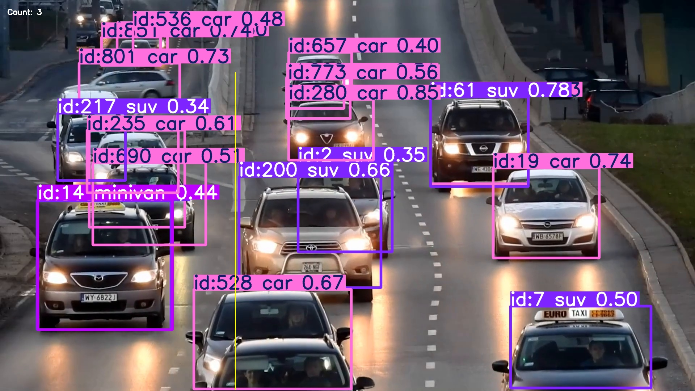
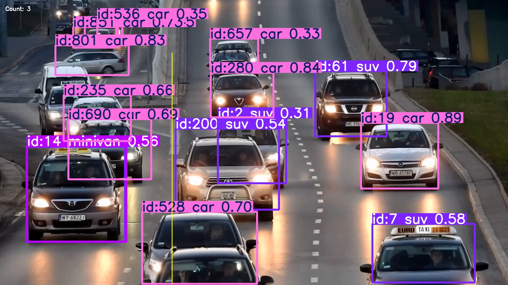
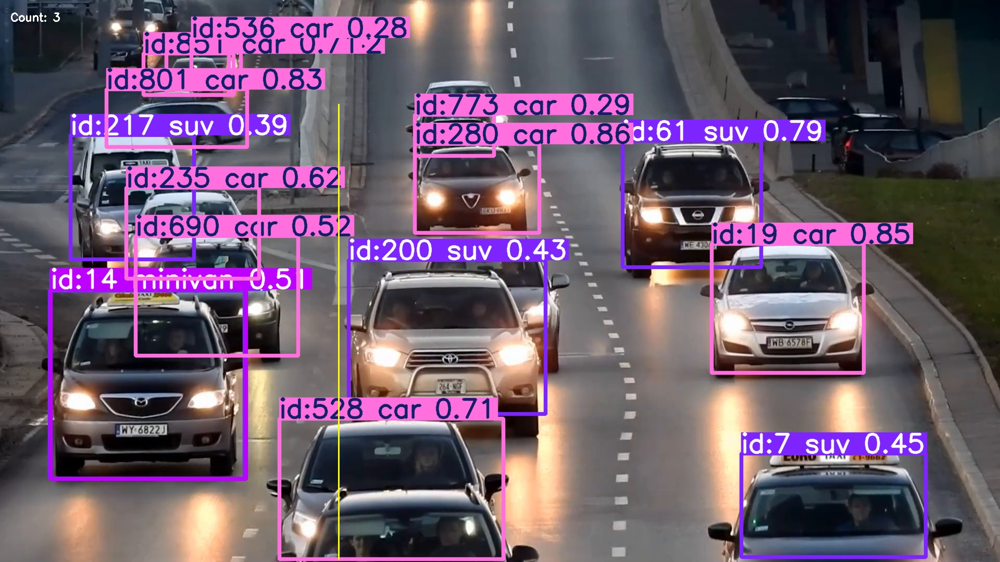
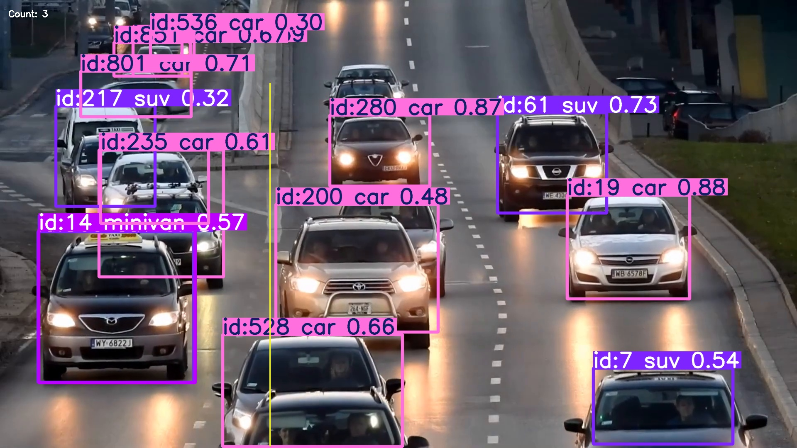

分析：ByteTrack 通过检测结果与历史轨迹进行关联，遮挡时更依赖轨迹的一致性。该片段中 id:2 在 468-469 帧仍可被检测到，470-471 帧遮挡加重导致短时丢失，但未出现与其他车辆的 ID 互换。整体符合“遮挡导致置信度下降、轨迹短暂断开”的典型情况。

## 7. 越线计数功能
- 计数逻辑：检测框中心点与虚拟线两侧符号变化来判断跨越，同一 ID 只计一次。
- 虚拟线设置：起点 (650, 200) -> 终点 (650, 1075)
- 实验结果：统计到 4 个车辆跨线，与视频实际情况一致。

## 8. 代码与权重链接
- GitHub 仓库：https://github.com/Shadow-alpha/Midterm_IC_OD_SS
- 模型权重及视频演示下载：https://drive.google.com/drive/folders/1kRwruFwGzfMdg6JiENeIxv4JkSzs9Tqf?usp=sharing

## 9. 复现实验说明（简要）
```bash
# 训练
python train_yolov8.py --config config.yaml

# 跟踪与计数
python track_and_count.py --config config.yaml
```
